# Stellar Parameter Inference for Cool Dwarfs from Multi-Survey Photometry

*ASTR199 Research Project*

A supervised deep learning pipeline that infers effective temperature (T<sub>eff</sub>) and surface gravity (log *g*) for F/G/K/M cool dwarfs from broad-band photometry alone, without spectroscopic follow-up.

**Best results:** T<sub>eff</sub> R² = 0.965 (RMSE = 144 K) · log *g* R² = 0.833 (RMSE = 0.118 dex)

---

## Table of Contents
1. [Introduction](#1-introduction)
2. [Data](#2-data)
3. [Feature Engineering and Exploratory Analysis](#3-feature-engineering-and-exploratory-analysis)
4. [The Modeling Journey](#4-the-modeling-journey)
5. [Results Summary](#5-results-summary)
6. [Discussion](#6-discussion)
7. [Conclusions and Future Work](#7-conclusions-and-future-work)

---

## 1. Introduction

### 1.1 Motivation

T<sub>eff</sub> and log *g* are foundational stellar parameters. T<sub>eff</sub> determines spectral class and luminosity; log *g* ≡ log₁₀(GM/R²) separates dwarfs (log *g* ≈ 4.0–5.0) from subgiants and giants (log *g* ≲ 4.0), placing each star in its evolutionary context. Both are prerequisites for exoplanet characterization — transit depth and radial-velocity amplitude only yield planet radius and mass once the host star's R<sub>★</sub> and M<sub>★</sub> are known.

Spectroscopic surveys (LAMOST, APOGEE) measure these parameters precisely but are limited by fiber time and targeting selection. Wide-field photometric surveys (Gaia, Pan-STARRS, 2MASS, WISE) observe billions of stars with no spectroscopy. This project asks: **can photometry alone infer T<sub>eff</sub> and log *g* reliably?**

### 1.2 The Color–log *g* Degeneracy

For T<sub>eff</sub>, the answer is straightforwardly yes — broad-band colors encode the slope of the spectral energy distribution (SED), which shifts systematically with temperature. For log *g*, the problem is fundamentally harder. At fixed color (fixed T<sub>eff</sub>), a main-sequence dwarf and a subgiant produce nearly identical SEDs. The subgiant is intrinsically brighter — its larger radius radiates more total flux — but this luminosity difference is invisible in distance-independent colors. Overcoming this **color–log *g* degeneracy** is the central technical challenge of this work.

---

## 2. Data

### 2.1 Sources and Integration

| Survey | Role |
|--------|------|
| LAMOST DR8 + DR10 (inner join on LAMOST ID) | Spectroscopic labels (T<sub>eff</sub>, log *g*) |
| Gaia DR3 (join on Gaia source ID) | Astrometry; parallax-based distances |
| Gaia EDR3, 2MASS, WISE, APASS, SDSS, Pan-STARRS | 19 photometric bands |

Ground-truth T<sub>eff</sub> and log *g* labels are from the LAMOST DR10 pipeline. Cross-matching is done strictly on unique source IDs (no spatial-radius matching) to eliminate false positives.

### 2.2 Quality Control

- SNR<sub>r</sub> ≥ 5 and SNR<sub>i</sub> ≥ 5
- Sentinel values −999, −9999 → NaN; rows with any NaN in required bands or labels dropped
- 1σ statistical outlier clipping
- 2000 ≤ T<sub>eff</sub> ≤ 5300 K; uniqueness and Pastel reliability flags applied

**Final catalog: ~904,000 FGKM dwarfs, 197 columns.**

---

## 3. Feature Engineering and Exploratory Analysis

### 3.1 171 Color Indices

All pairwise magnitude differences from 19 photometric bands:

```math
\text{COLOR}_{ij} = m_i - m_j, \qquad \binom{19}{2} = 171 \text{ features}
```

Colors are distance-independent and encode SED shape without survey zero-point dependence.

### 3.2 19 Absolute Magnitude Features

Absolute magnitudes derived via the Gaia distance modulus:

```math
M_b = m_b - 5\log_{10}(d / 10\,\text{pc})
```

These features encode intrinsic luminosity — the physical quantity that discriminates dwarfs from subgiants at fixed temperature.

- **190-feature set** = 171 colors + 19 absolute magnitudes
- **191-feature set** = 190 photometric + 1 predicted log₁₀(T<sub>eff</sub>) (two-stage pipeline only)

### 3.3 Target Transformation

T<sub>eff</sub> → log₁₀(T<sub>eff</sub>) to compress the dynamic range and stabilize gradient flow. log *g* is used as-is.

### 3.4 Exploratory Data Analysis

Colors show tight, monotonic correlations with T<sub>eff</sub> across all survey bands:

| | |
|---|---|
| 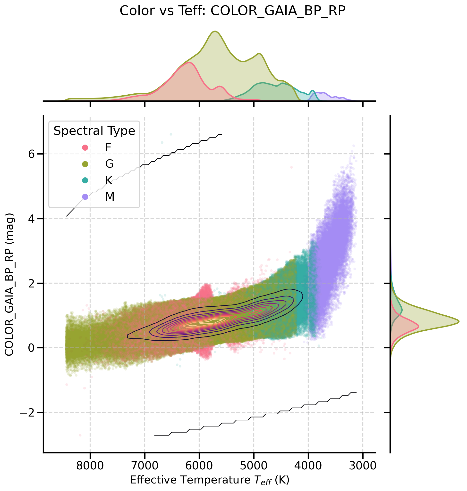 | 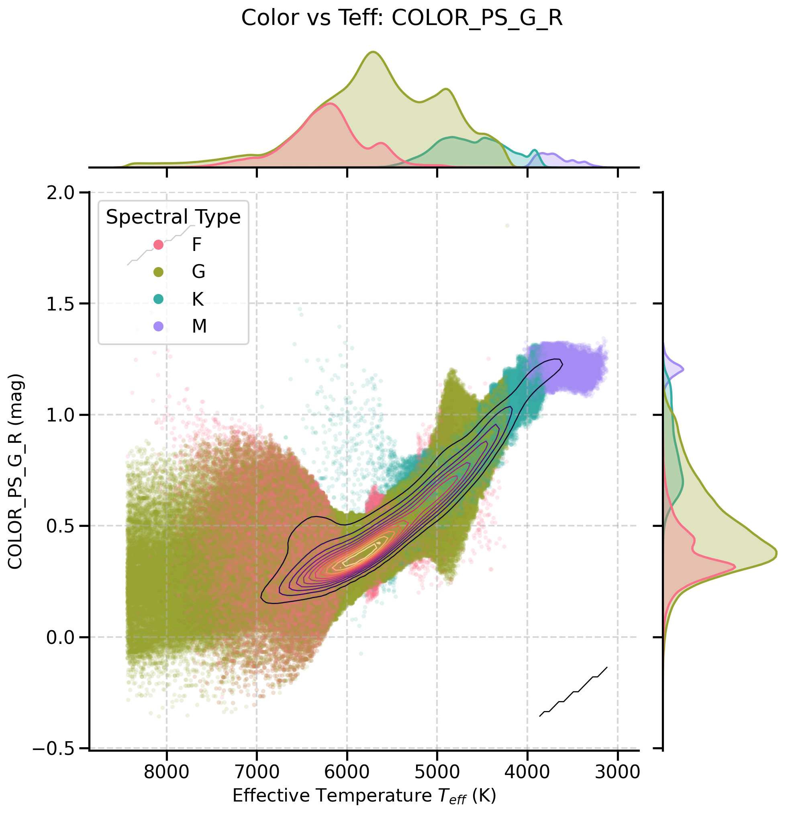 |
| *Fig 1: Gaia G<sub>BP</sub>−G<sub>RP</sub> vs T<sub>eff</sub> — strongest single-color predictor* | *Fig 2: Pan-STARRS g−r vs T<sub>eff</sub> — tightest optical correlation* |

| | |
|---|---|
| 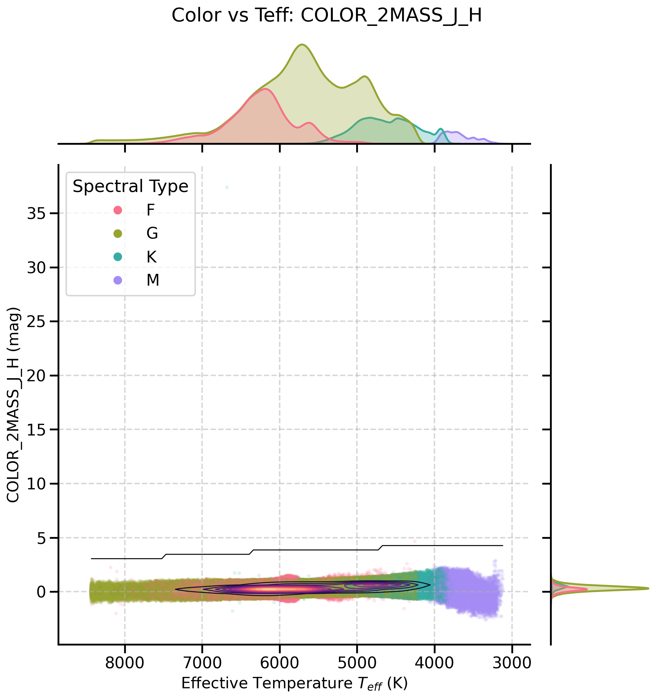 | 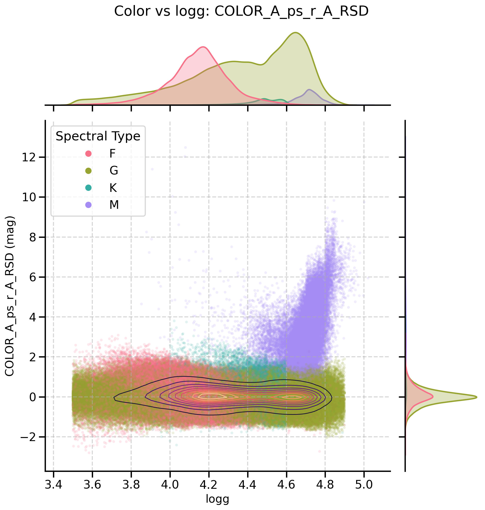 |
| *Fig 3: 2MASS J−H vs T<sub>eff</sub> — near-IR sensitivity for cool M dwarfs* | *Fig 4: Same color vs log g — near-zero correlation; the degeneracy is real* |

Fig 4 is the empirical proof of the challenge: the same color that predicts T<sub>eff</sub> to within a tight band tells us almost nothing about log *g*.

---

## 4. The Modeling Journey

**Training protocol** (common to all models): 70/15/15 train/val/test split stratified by spectral type; T<sub>eff</sub>-binned oversampling (150 K bins) to balance spectral type representation; StandardScaler fit on pre-augmentation training data; MSE loss; Adam optimizer; ReduceLROnPlateau LR schedule; early stopping with patience = 30 epochs.

---

### Phase 1 — Teff Baseline (171 color features)

**Architecture** (`StellarTeffNet`): `171 → 256 → 128 → 64 → 32 → 1`, BatchNorm + ReLU + Dropout at each hidden layer.

**Result: R² = 0.965, RMSE = 144 K** (best epoch 36)

| | |
|---|---|
| 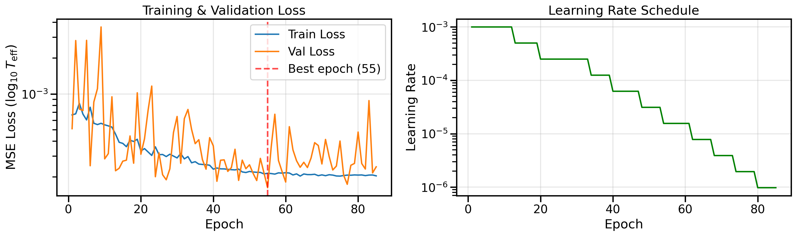 | 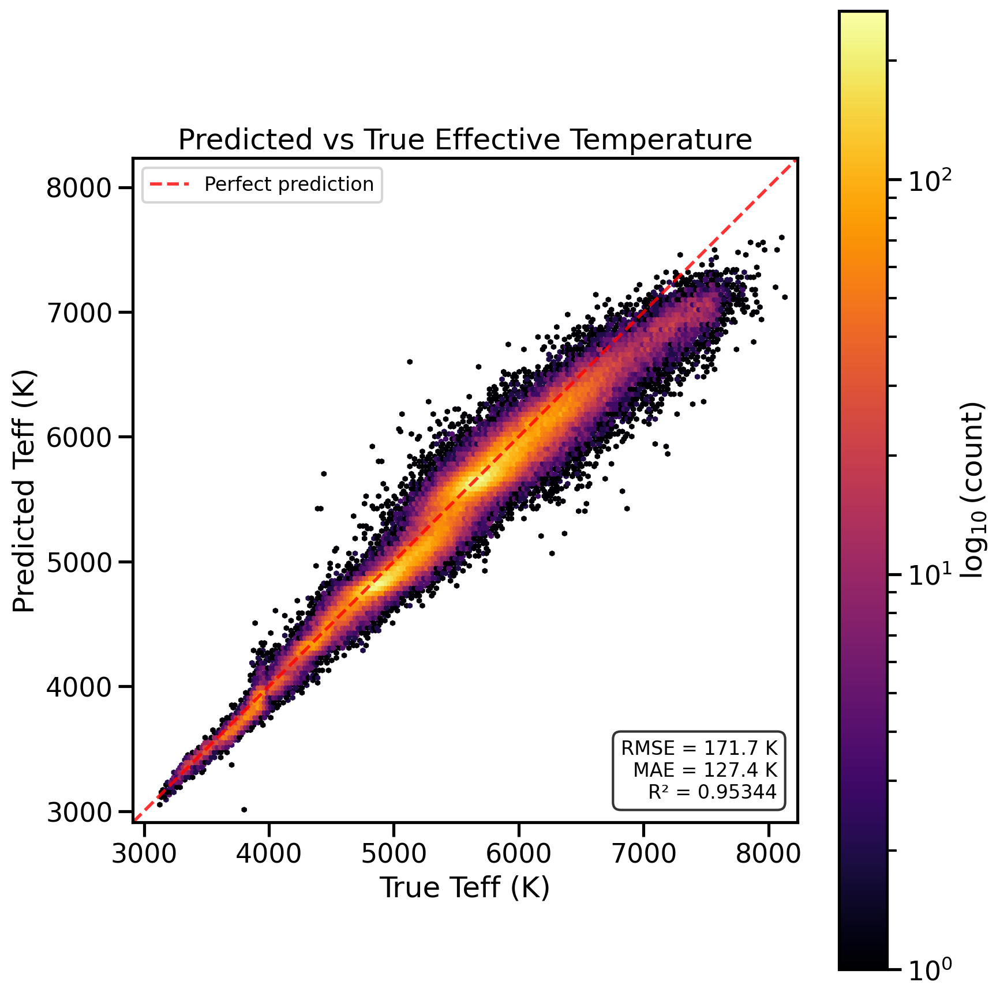 |
| *Fig 5: Training/val loss (log scale). Val loss sits below train loss early — expected, as augmentation inflates training difficulty. Best epoch 36 marked.* | *Fig 6: True vs predicted T<sub>eff</sub>. Tight diagonal across 3800–8000 K. Mean residual = −28.3 K.* |

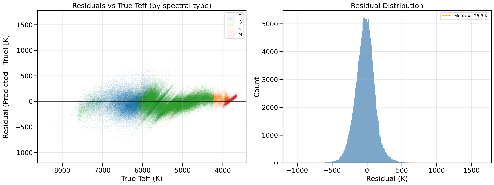
*Fig 7: Residuals by spectral type. Near-Gaussian distribution centered at −28.3 K.*

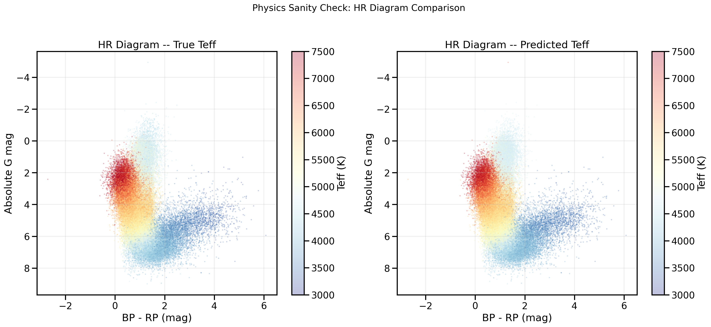
*Fig 8: Physics sanity check — the model's predicted T<sub>eff</sub> (right) recovers the main-sequence temperature gradient nearly identically to the true labels (left), confirming physically self-consistent predictions.*

**Takeaway:** Color features are highly informative for T<sub>eff</sub>. This model serves as Stage 1 of the final pipeline.

---

### Phase 2 — Direct log g Regression (171 color features)

Three architectures tested, all using 171-color features (PCA-reduced internally):

| Architecture | R² | RMSE |
|---|---|---|
| 2-layer ANN | 0.444 | 0.215 dex |
| 4-layer ANN | 0.488 | 0.206 dex |
| Residual ANN | 0.519 | 0.199 dex |

| | |
|---|---|
| 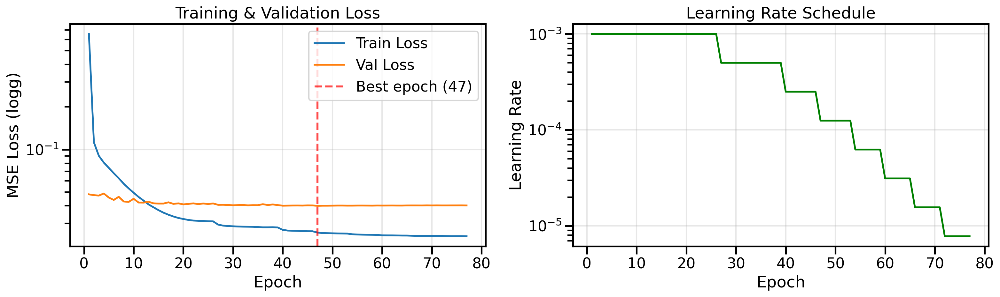 | 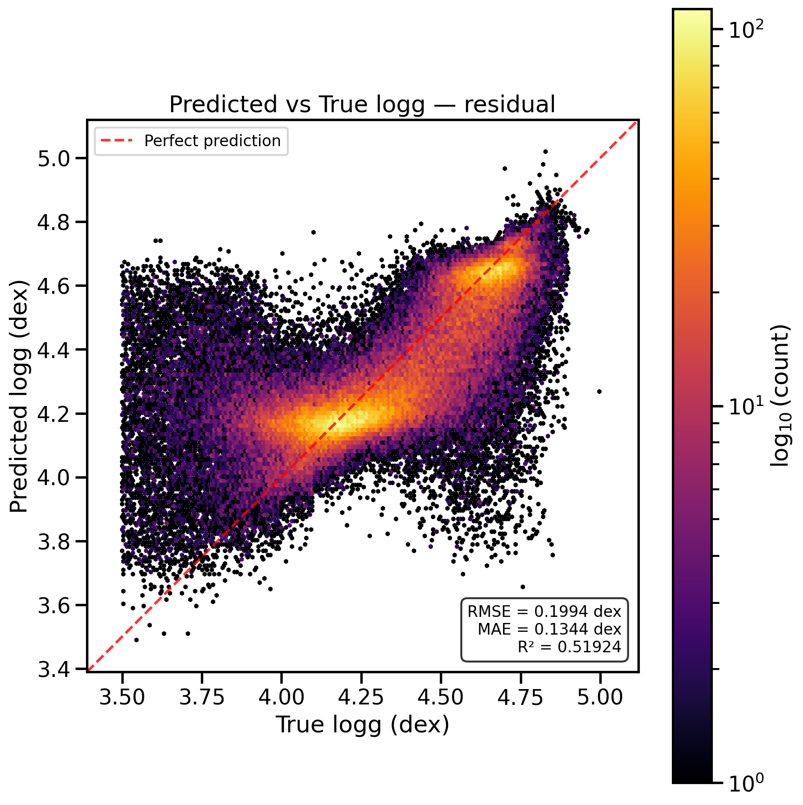 |
| *Fig 9: Training diagnostics for best single-output model (Residual ANN, best epoch 47). Mild overfitting after the best epoch.* | *Fig 10: Predicted vs true log g. The wide fan-shaped scatter is the signature of the color–log g degeneracy. Predictions are pulled toward the mean regardless of the true value.* |

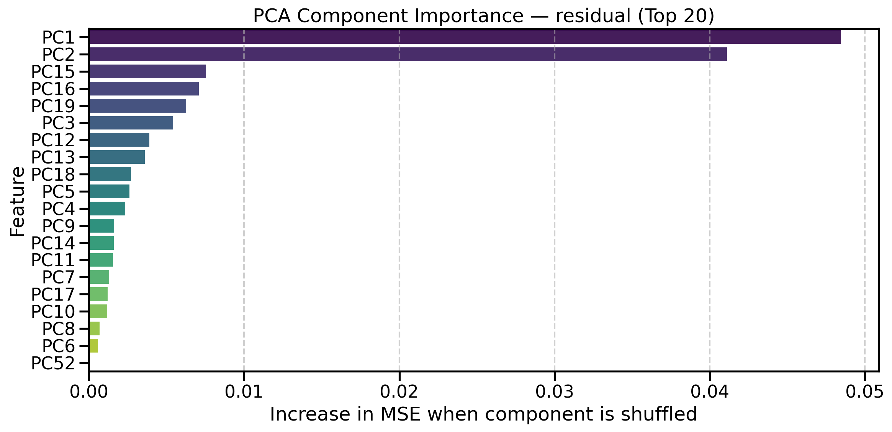
*Fig 11: PCA component importance. PC1 and PC2 — which encode the temperature gradient — dominate overwhelmingly. The model exploits the T<sub>eff</sub>–log g covariance along the main sequence, not a direct luminosity signal, because no luminosity information exists in the color features.*

**Takeaway:** The ceiling at R² ≈ 0.52 is not a model capacity problem — it is observational. Colors do not contain the required luminosity signal.

---

### Phase 3 — Joint Multi-Output Model (Teff + log g)

A two-headed ANN trained jointly with HomoscedasticUncertaintyLoss, which learns per-task noise scales σ<sub>T</sub> and σ<sub>g</sub> to auto-balance gradient contributions:

```math
\mathcal{L} = \frac{1}{2\sigma_{T}^2}\,\mathcal{L}_{T_\text{eff}} + \log\sigma_{T} + \frac{1}{2\sigma_{g}^2}\,\mathcal{L}_{\log g} + \log\sigma_{g}
```

**Result: R² = 0.483, RMSE = 0.207 dex** — worse than the single-output baseline.

| | |
|---|---|
| 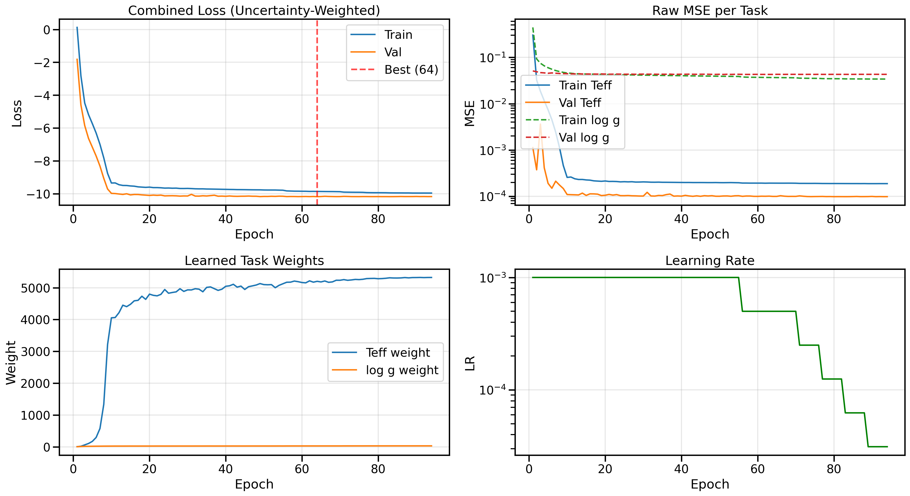 | 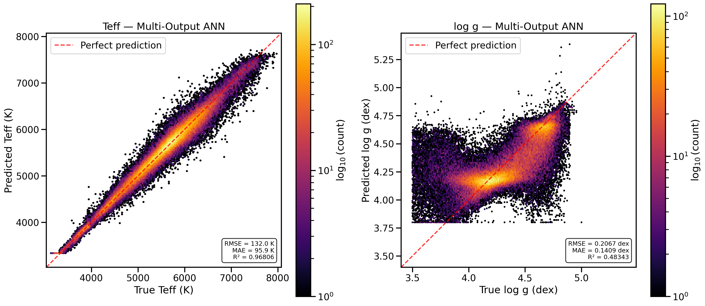 |
| *Fig 12a: Task-collapse. Bottom-left: T<sub>eff</sub> weight (blue) rises to ~5,000 while log g weight (orange) collapses to ~0. The model assigned near-infinite uncertainty to log g, muting its gradient entirely.* | *Fig 12b: T<sub>eff</sub> predictions remain good. Log g predictions degenerate to a near-flat line — the model predicts the training-set mean.* |

**Takeaway:** Unconstrained joint loss balancing causes task collapse when one task is inherently easier. The solution must be at the feature level, not the loss level.

---

### Phase 4 — Feature Expansion to 190 Features (Transitional)

Absolute magnitudes (19 M<sub>b</sub> features) added to validate their behavior. T<sub>eff</sub> model retrained: **R² = 0.956, RMSE = 154 K** — marginal regression vs. the 171-feature baseline. Absolute magnitudes add little T<sub>eff</sub> signal once colors are already provided, but confirms the features are well-behaved and ready for log g use.

---

### Phase 5 — Two-Stage Pipeline (191 features)

**Design rationale:**
1. Absolute magnitudes resolve the luminosity ambiguity: at fixed color, a subgiant is 1–3 mag brighter in M<sub>G</sub> than a main-sequence dwarf.
2. Predicted T<sub>eff</sub> anchors the star on the HR diagram, narrowing the residual log g uncertainty at a given temperature.

**Stage 1:** Pre-trained Phase 1 `StellarTeffNet` (171 features) → predicted log₁₀(T<sub>eff</sub>). Frozen.

**Stage 2:** `StellarLoggTwoStageNet` trained on 191 features (190 photometric + Stage 1 predicted log₁₀(T<sub>eff</sub>)).

> **Critical design choice:** Stage 2 uses Stage 1 *predictions* (not true labels) at both training and inference time. Using true labels would cause train/test distribution shift: at inference, only predicted T<sub>eff</sub> is available.

**Architecture:** `191 → ResBlock(256) → ResBlock(128) → Linear(64) → BN → ReLU → Dropout(0.10) → Linear(1)`
(256,385 parameters; train: 2,163,707 augmented samples; val/test: 135,664 / 135,665)

**Result: R² = 0.833, RMSE = 0.118 dex, MAE = 0.085 dex** (best epoch 46 of 146)

| | |
|---|---|
| 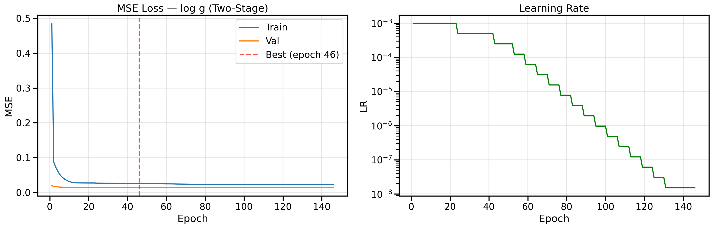 | 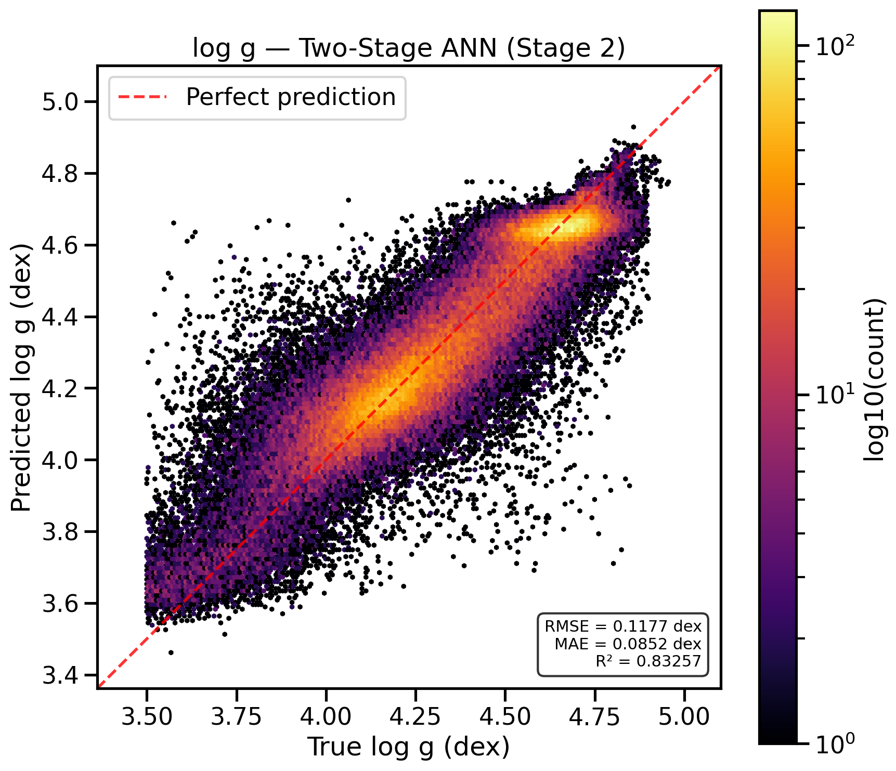 |
| *Fig 13: Convergence. Val loss flat from early epochs; LR decays to 10⁻⁸.* | *Fig 14: True vs predicted log g. Dense diagonal across 3.5–5.1 dex. Mean residual = 0.0013 dex (essentially unbiased).* |

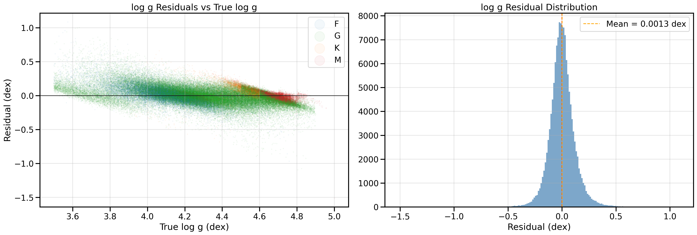
*Fig 15: Residuals vs true log g by spectral type (left) and residual distribution (right). Regression-to-mean trend visible: over-prediction at low log g, under-prediction at high. K-dwarfs (orange, ~4.4–4.6 dex range) show elevated scatter.*

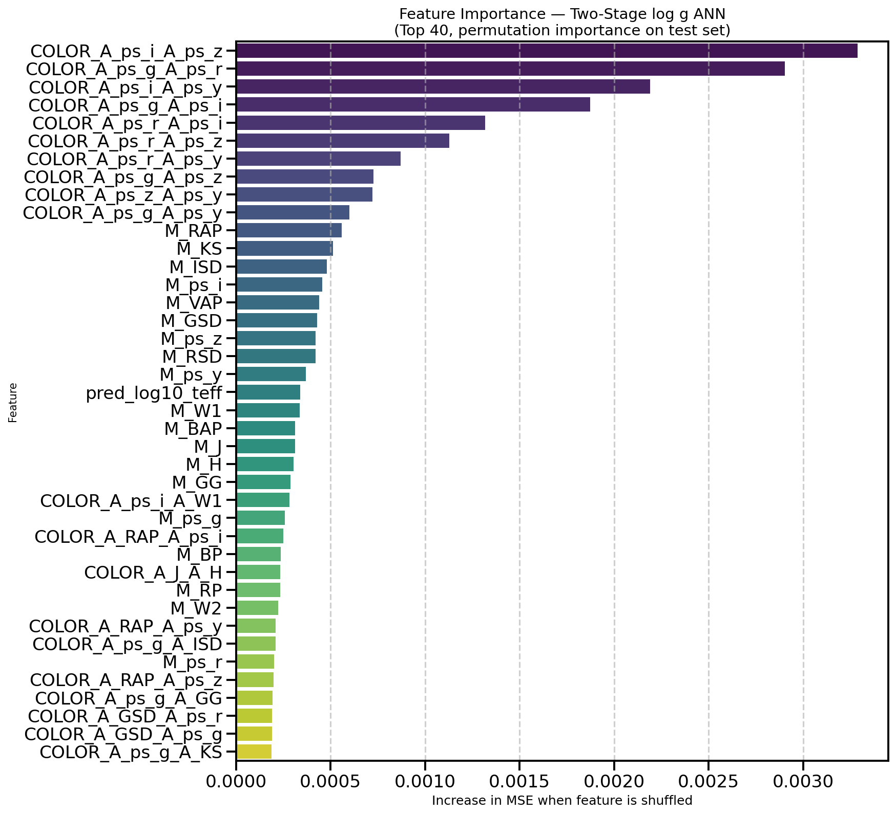
*Fig 16: Permutation feature importance (top 40). Top 10 are exclusively Pan-STARRS optical colors (i−z, g−r, i−y, g−i, r−i…). Absolute magnitudes appear at rank 11 (M<sub>RAP</sub>, M<sub>KS</sub>, M<sub>ISD</sub>…). Predicted log₁₀(T<sub>eff</sub>) ranks 20th.*

---

## 5. Results Summary

### 5.1 All Models

| Phase | Model | Features | T<sub>eff</sub> R² | T<sub>eff</sub> RMSE | log g R² | log g RMSE |
|---|---|---|:---:|:---:|:---:|:---:|
| 1 | Teff Baseline ANN | 171 colors | **0.965** | **144 K** | — | — |
| 2 | Residual ANN (single-output) | 171 colors | — | — | 0.519 | 0.199 dex |
| 3 | Joint Multi-Output | 171 colors | — | — | 0.483 | 0.207 dex |
| 4 | Teff-190 ANN (transitional) | 190 | 0.956 | 154 K | — | — |
| **5** | **Two-Stage Pipeline** | **191** | — | — | **0.833** | **0.118 dex** |

### 5.2 Per-Spectral-Type Breakdown — Two-Stage log g

| Type | N (test) | log g R² | log g RMSE |
|:---:|---:|:---:|:---:|
| F | 41,225 | 0.592 | 0.106 dex |
| G | 86,818 | 0.829 | 0.123 dex |
| K | 2,834 | −0.521 | 0.157 dex |
| M | 4,788 | 0.368 | 0.069 dex |

*Per-type R² is for diagnostic purposes; overall R² = 0.833 is the training metric.*

---

## 6. Discussion

### 6.1 Why the Two-Stage Pipeline Works

The HR diagram (Fig 8) illustrates the mechanism directly: at G<sub>BP</sub>−G<sub>RP</sub> ≈ 1.0, main-sequence dwarfs sit at M<sub>G</sub> ≈ 4–5, while subgiants appear at M<sub>G</sub> ≈ 2–3 — a separation invisible in colors but immediate in absolute magnitudes. The feature importance plot (Fig 16) confirms that absolute magnitude features (M<sub>RAP</sub>, M<sub>KS</sub>, M<sub>ISD</sub>) become the leading non-color contributors once colors have saturated their predictive capacity.

The predicted T<sub>eff</sub> anchor (ranked 20th) contributes by constraining the star's position along the main-sequence temperature axis, reducing residual log g uncertainty. Together, the two additions effectively reconstruct the HR-diagram position from photometry alone.

### 6.2 The K-Dwarf Problem

K dwarfs show R² = −0.521 — worse than a mean prediction. K dwarfs in this catalog occupy a narrow log g range (~4.4–4.6 dex) with little intrinsic variance. Combined with severe class imbalance (2,834 K dwarfs vs 86,818 G dwarfs in the test set), the model learns to predict a near-constant value, producing large residuals for K dwarfs that deviate. This remains an open problem.

### 6.3 Residual Structure and Regression-to-Mean

The systematic trend in Fig 15 (over-prediction at low log g, under-prediction at high) reflects MSE regression on an imbalanced target distribution: the model is pulled toward the high-density training region (~4.2–4.6 dex). A density-weighted loss could mitigate this in future work.

### 6.4 Limitations

- Gaia parallax uncertainty propagates into absolute magnitude features (dominant for *d* ≳ 1 kpc)
- Survey photometric systematics not explicitly corrected
- All labels from LAMOST DR10 — systematic errors in that pipeline are absorbed into model predictions

---

## 7. Conclusions and Future Work

### 7.1 Summary

| Parameter | Best model | R² | RMSE |
|---|---|:---:|:---:|
| T<sub>eff</sub> | Baseline ANN, 171 features | **0.965** | **144 K** |
| log *g* | Two-Stage ANN, 191 features | **0.833** | **0.118 dex** |

The key insight is physical: photometric colors encode temperature but not luminosity. No model architecture can infer log g accurately from colors alone because the required observable is absent. Adding Gaia-parallax-derived absolute magnitudes and a predicted T<sub>eff</sub> anchor resolves the degeneracy, yielding a +0.314 R² gain over the color-only ceiling. The K-dwarf class remains a failure case due to its narrow intrinsic log g range.

### 7.2 Future Work

**GradNorm multi-output model** *(designed, not yet executed)*: a shared residual backbone with two heads for joint T<sub>eff</sub>/log g prediction. GradNorm (Chen et al. 2018) dynamically normalizes per-task gradient magnitudes each epoch, preventing the task-collapse failure of Phase 3. This would enable single-inference-pass prediction of both parameters.

**K-dwarf targeted approaches**: a dedicated K-dwarf sub-model trained on a class-rebalanced subset, or a density-weighted loss sensitive to the narrow log g range.

**Metallicity [Fe/H]** as a third regression target — a natural extension of the two-stage design.

---

## Repository Structure

```
notebooks/
  teff_pipeline/          ← data cleaning, cross-matching, Teff baseline (Phase 1)
  logg_pipeline/          ← single-output log g experiments (Phase 2)
  multi_output_pipeline/  ← joint model (Phase 3), two-stage pipeline (Phase 5)
models/
  teff/                   ← Phase 1 saved model
  logg/residual/          ← Phase 2 best model
  logg_twostage/          ← Phase 5 saved model
results/
  consolidated_analysis/  ← EDA color–Teff/logg plots
  logg/residual/          ← Phase 2 diagnostics
  multi_output/           ← Phase 3 diagnostics
  teff_190/               ← Phase 4 diagnostics
  logg_twostage/          ← Phase 5 diagnostics (main results)
data/
  logg_final_df/cool_dwarf_catalog_FGKM_consolidated.csv  ← primary dataset (~904K stars)
```

## Environment

```bash
conda activate astro
C:/Users/user1/miniconda3/envs/astro/python.exe <script>
```
