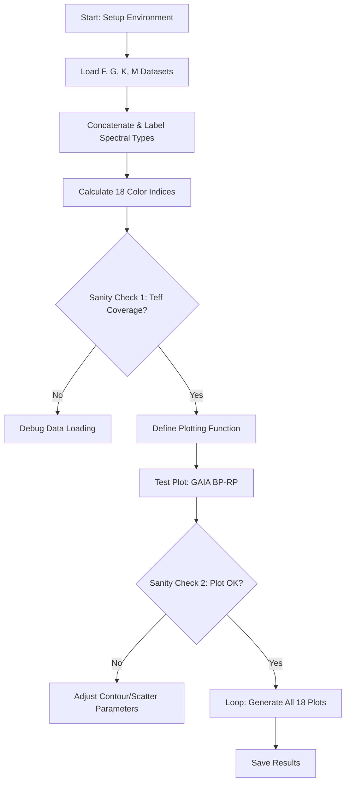

# Plan: Consolidated Color vs Teff Analysis for F, G, K, M Dwarfs

## 1. Objective
Create a single notebook to visualize the color-temperature relationship across all spectral types (F, G, K, M), producing contour plots for all 18 color combinations with a continuous x-axis (Teff).

## 2. Proposed Notebook Structure

### Phase 1: Environment Setup
- Import libraries: `pandas`, `numpy`, `matplotlib`, `seaborn`, `astropy`.
- Define global paths (data directory, results directory).
- Set plotting style for publication-quality figures.

### Phase 2: Data Loading & Preprocessing (Sanity Check 1)
- **Step 2.1**: Load `Xmatch_gaia_LAMOST_LAMOSTvac_F_dwarf.csv` as a test case.
- **Step 2.2**: Implement a function to load all 4 spectral types (F, G, K, M) and concatenate them into a single dataframe.
- **Step 2.3**: Add a `spectral_type` column to track the origin of each data point.
- **Sanity Check**: Verify the Teff range covers from ~3000K to ~8000K+.

### Phase 3: Color Calculation
- Implement the standard color indexing logic used in the `outlier_filtering_*.ipynb` notebooks.
- Define the dictionary of 18 color combinations (e.g., `BP-RP`, `G-R`, `J-H`, etc.).
- Handle missing magnitudes gracefully.

### Phase 4: Visualization Function
Create a robust function `plot_color_vs_teff(color_name)`:
- **Layer 1 (Density)**: Use `sns.kdeplot` or `plt.contour` to show the overall density of points.
- **Layer 2 (Scatter)**: Plot individual data points, color-coded by spectral type (F, G, K, M) with low alpha.
- **Formatting**:
    - Long x-axis (Teff) inverted (standard in astronomy).
    - Consistent y-axis label (Color Index).
    - Legend for spectral types.

### Phase 5: Testing & Execution (Sanity Check 2)
- **Step 5.1**: Run the plotting function for 1 representative color (e.g., `COLOR_GAIA_BP_RP`).
- **Step 5.2**: Inspect the output for density artifacts or incorrect scaling.
- **Step 5.3**: Loop through all 18 colors and save figures to `results/consolidated_plots/`.

## 3. Workflow Diagram

## 4. Key Considerations
- **Memory Management**: With hundreds of thousands of rows, contour calculation might be slow. Consider downsampling for the KDE layer if needed.
- **Outlier Visibility**: Since the goal is "outlier filtering" context, should we show filtered vs. unfiltered data? (Requirement says "represent the density").
- **Teff Inversion**: Ensure the x-axis starts at high Teff (left) and ends at low Teff (right).

## 5. Proposed File Path
`notebooks/consolidated_color_teff_analysis.ipynb`
